# Jewellery-e-Commerce


## Table of Contents

- [Description](#description)
- [User Story](#user-story)
- [Acceptance Criteria](#acceptance-criteria)
- [Screenshot](#screenshot)
- [Installation](#installation)
- [Features](#features)
- [Live URL](#live-url)
- [Contributors](#contributors)
- [Testing](#testing)
- [Questions](#questions)
- [License](#license)

## Description

The Jewellery-e-Commerce online platform has been designed in the context of a scalable, user-focused MERN stack single-page application. It works with real-world data to solve a real-world challenge, with a focus on data and user demand.

## User Story

AS a owner of the Jewellery company<br />
I WANT to have an online platform selling our Jewellery products<br />
SO THAT customers can browse and purchase their favourite Jewellery.

## Acceptance Criteria

GIVEN a Online Jewellery Store<br />
WHEN I visit the site for the first time<br />
THEN I am presented with the homepage, which includes the categories of Jewellery products available in the database. On the top of the page, there are navigation links for the homepage, the shopping bag; the option to log in, signin or logout, view user profile and a search bar<br />
WHEN I click on the homepage option<br />
THEN I am taken to the homepage<br />
WHEN I click on any category of Jewellery products in the homepage<br />
THEN I am presented with a page containing a list of the Jewellery items of that category. For each Jewellery item, there is a “ADD TO BAG” button.<br />
WHEN I click on any Jewellery item<br />
THEN I am presented with a page showing the detail of that Jewellery item with size and quantity can be selected on the page<br />
WHEN I am logged on and click the “ADD TO BAG” button on the Jewellery item<br />
THEN that Jewellery item is added to the shopping bag.<br />
WHEN I click the “Login” on the navigation links<br />
THEN I am presented with a login page with email and password textbox for input<br />
WHEN I input the email and password and click the “Submit” button in login page<br />
THEN I am able to login to the online comics store site<br />
WHEN I click the “SIGN UP” button in the “Log in” page<br />
THEN I am presented with a signup page with email and password textbox for input<br />
WHEN I input the email and password and click the “SIGN UP” button in sign up page<br />
THEN an account is created in the database and I am able to login to the online Jewellery store site<br />
WHEN I am logged on and click the “View Profile” icon in the navigation link<br />
THEN I am presented with a page showing the member information.<br />
WHEN I click the “Shopping Bag” icon on the navigation links<br />
THEN I am presented with the checkout page listing the Jewellery items we added to the shopping bag.<br />
WHEN I click the “Back to Shopping” button on checkout page<br />
THEN I am presented with the homepage to continue our shopping<br />
WHEN I click the “CONFIRM ORDER” button on checkout page<br />
THEN I am presented with a Stripe online payment page to input the credit card information for processing the payment.

## Screenshot


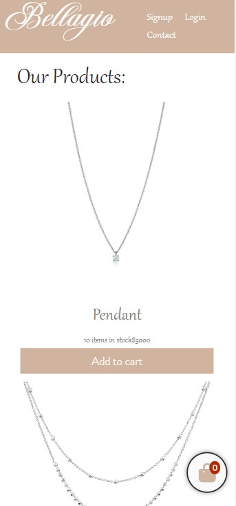
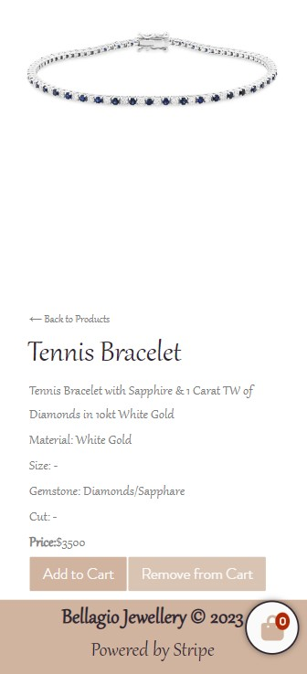

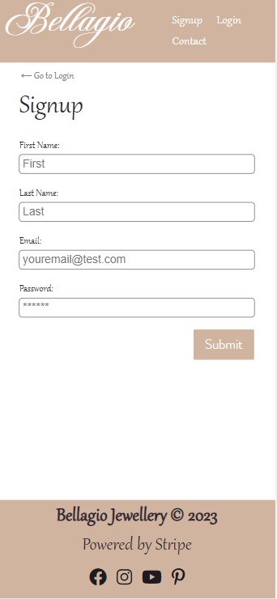
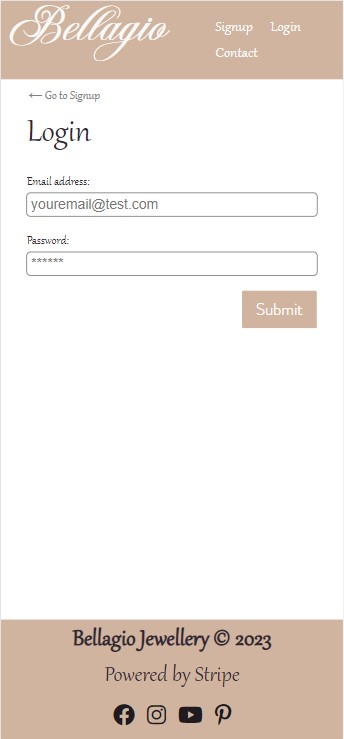
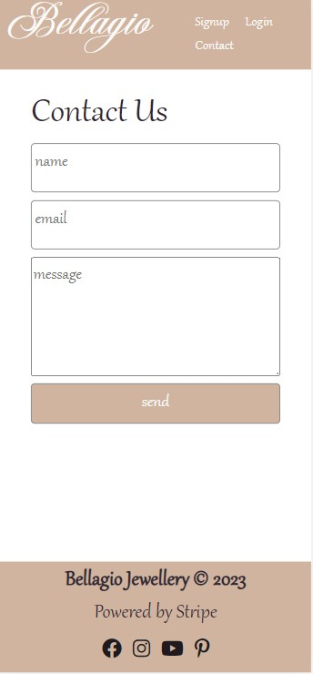
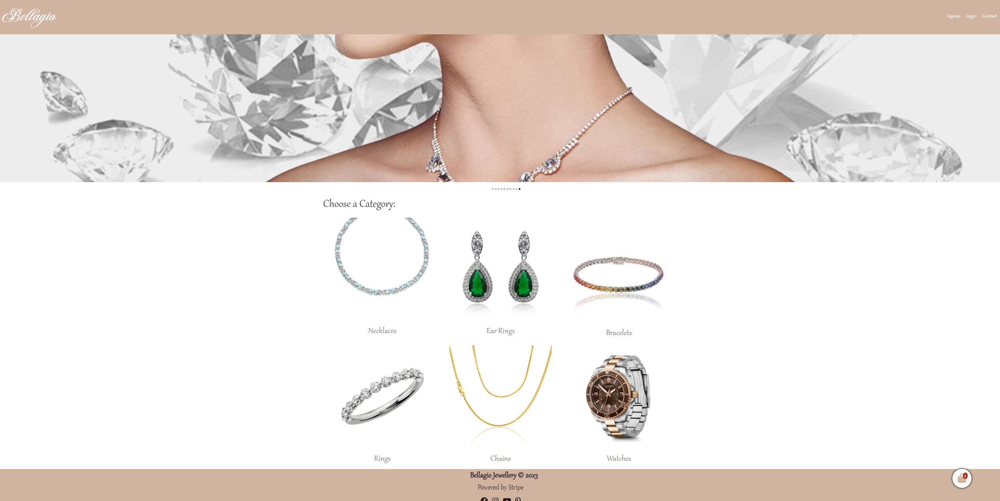
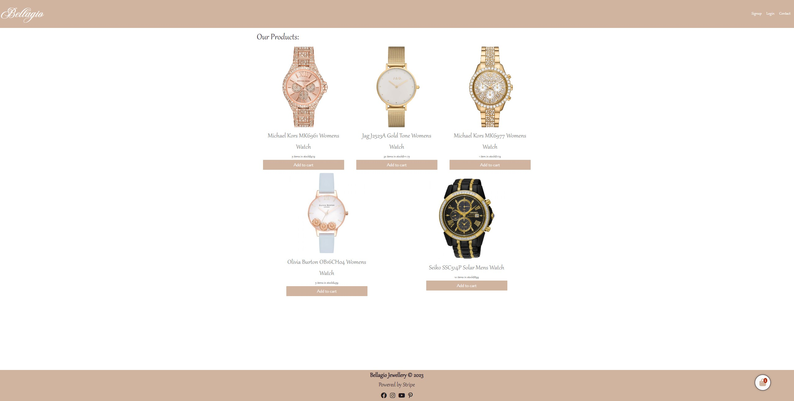
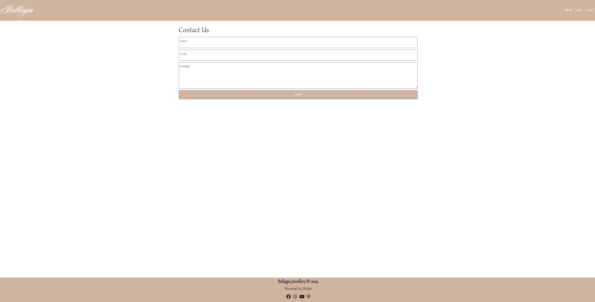
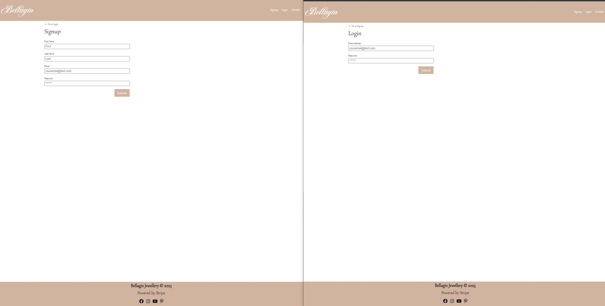

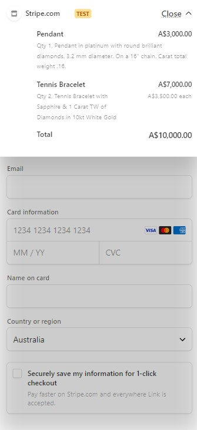
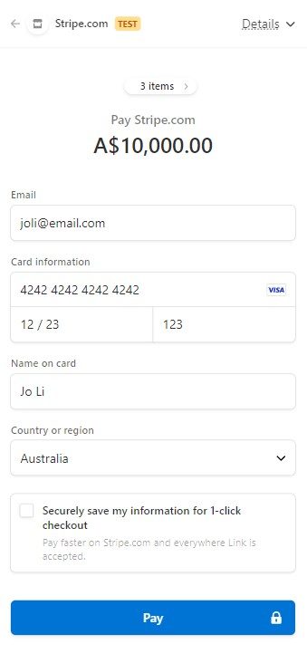
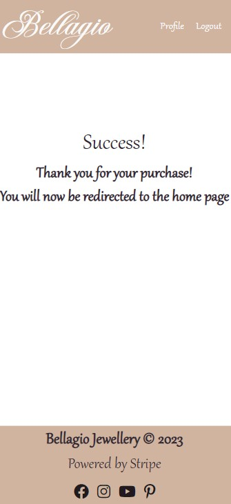
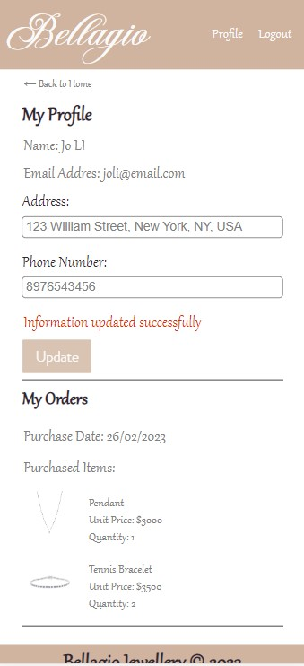


## Installation

```
1. "npm i"
```

```
2. "npm run seed"
```

```
3. "npm run develop"
```

## Features

- MERN stack single-page application
- Uses React for the front end
- Uses GraphQL with a Node.js and Express.js server.
- Uses MongoDB and the Mongoose ODM for the database.
- Uses queries and mutations for retrieving, adding, updating, and deleting data.
- Is deployed using Heroku (with data).
- Has a polished UI.
- Is responsive.
- Is interactive (in other words, accepts and responds to user input).
- Includes authentication (JWT).
- Protects sensitive API key information on the server.
- Meets good-quality coding standards (file structure, naming conventions, follows best practices for class/id naming conventions, indentation, quality comments).

## Live URL

## Future Development

- 2 Factors Authentication
- Membership Discount Feature
- Sorting and Filtering Feature
- Email function for sending OTP and order confirmation
- Size item selection
- Improvement in History details such as invoice number and address.
- Favourite List

## Contributors

- GitHub: [chengpitchi](https://github.com/chengpitchi)
- GitHub: [lilianaba](https://github.com/lilianaba)
- GitHub: [NebsterOne](https://github.com/NebsterOne)

## Testing

> APIs were malually tested

> Application is tested by manual test scripts through the Chrome browser.

## Questions

Please send your questions [here](mailto:findme@gmail.com?subject=[GitHub]%20Dev%20Connect) or visit GitHubs: [lilianaba](https://github.com/lilianaba), [chengpitchi](https://github.com/chengpitchi) or [NebsterOne](https://github.com/NebsterOne).

## License

MIT
